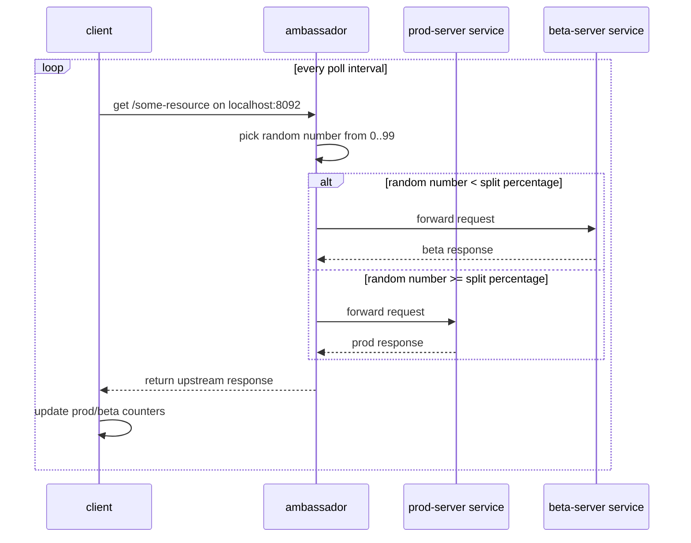

# ambassador

this is a simple ambassador pattern implementation for splitting a client's requests between a stable prod server and a beta server. a companion proxy container sits beside the client, receives the client's local requests, and forwards each request to either `prod_server` or `beta_server`.

the client does not call prod or beta directly. it only calls its colocated ambassador at `localhost:8092`. the ambassador applies the split rule, then forwards the request to the selected upstream service.

## architecture

- **prod server:** stable upstream server that handles normal traffic
- **beta server:** alternate upstream server that receives a configured percentage of traffic
- **ambassador:** local proxy that receives client requests and forwards each one to prod or beta
- **client:** polling client that calls the ambassador and prints response metrics

the client and ambassador run in the same kubernetes pod. that colocated shape is what lets the client use `localhost:8092` for the proxy. prod and beta run in separate pods behind kubernetes services.

## flow



the ambassador uses `-nsplit` as the beta percentage. for example, `-nsplit=20` means each request has a 20% chance of going to beta and an 80% chance of going to prod.

this is probabilistic splitting, not quota-based splitting. with small request counts, the observed percentage may be above or below the configured value. over many requests, it should trend toward the configured percentage.

## things to consider

inside the client pod, `localhost` means the shared pod network namespace. that is why the client calls the ambassador with `http://localhost:8092/`.

the ambassador should not use `localhost` for prod or beta in kubernetes, because those servers run in different pods. it should use the service dns names instead:

```text
http://prod-server:8090
http://beta-server:8091
```

each client pod has its own ambassador and its own local metrics. if the deployment has 5 replicas, there are 5 independent client counters. use `--prefix` when tailing logs across multiple pods so you can see which pod produced each line.

## usage

start minikube and build the images inside minikube's docker daemon:

```bash
minikube start
eval $(minikube docker-env)

docker build -f docker/Dockerfile.prod -t ambassador-prod:local .
docker build -f docker/Dockerfile.beta -t ambassador-beta:local .
docker build -f docker/Dockerfile.ambassador -t ambassador-proxy:local .
docker build -f docker/Dockerfile.client -t ambassador-client:local .
```

deploy everything:

```bash
kubectl apply -f k8s/

kubectl rollout status deployment/prod-server
kubectl rollout status deployment/beta-server
kubectl rollout status deployment/client-with-ambassador
```

watch all client logs:

```bash
kubectl logs -f -l app=client-with-ambassador -c client --tail=100 --prefix
```

watch the ambassador logs:

```bash
kubectl logs -f -l app=client-with-ambassador -c ambassador --tail=100 --prefix
```
the client log shows running metrics:

```text
received: 'this is the beta server!' | prod=259 beta=62 beta_percent=19.31 errors=1
```

to test the split rule, edit `-nsplit` in `k8s/client-with-ambassador.yaml`:

```yaml
- "-nsplit=20"
```

use `0` to send all traffic to prod:

```yaml
- "-nsplit=0"
```

use `100` to send all traffic to beta:

```yaml
- "-nsplit=100"
```

then apply and restart the client deployment:

```bash
kubectl apply -f k8s/client-with-ambassador.yaml
kubectl rollout restart deployment/client-with-ambassador
kubectl rollout status deployment/client-with-ambassador
```

recent logs should show the client polling through its local ambassador and the counters moving toward the configured split:

```bash
kubectl logs -l app=client-with-ambassador -c client --prefix --since=2m
```
