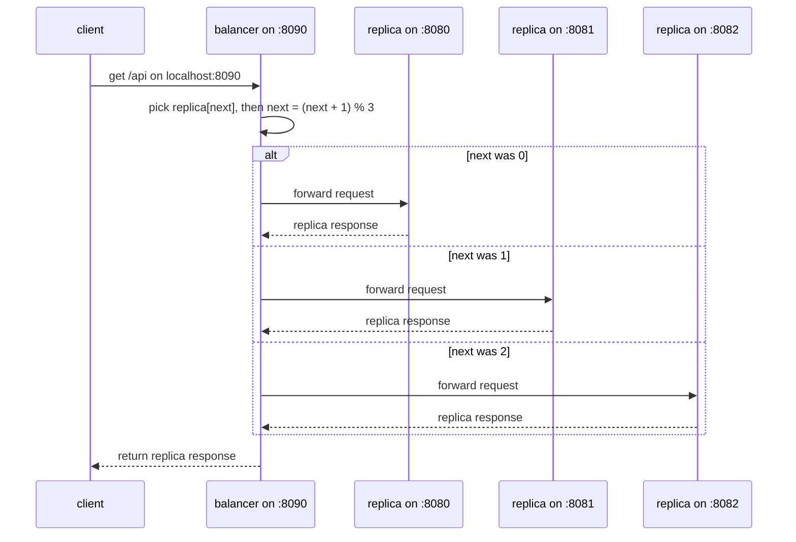

# replicated-lb

this is a simple replicated load balancer implementation for spreading client requests across identical app replicas. a small go proxy sits in front of the replicas, receives the client's requests, and forwards each request to the next replica in round-robin order.

the client does not call replicas directly. it only calls the balancer at `localhost:8090`. the balancer keeps the replica list, then forwards the request to the selected replica.

## architecture

- **app replicas:** identical servers that handle requests on `:8080`, `:8081`, and `:8082`
- **balancer:** round-robin proxy that receives client requests on `:8090` and forwards each one to the next replica
- **client:** any http client that calls the balancer (for example, `curl`)

the replicas and balancer all run locally as plain processes and talk to each other over `localhost`. that local shape is what lets the balancer use `http://localhost:8080`, `http://localhost:8081`, and `http://localhost:8082` as its replica addresses.

## flow



the balancer uses a `next` counter guarded by a mutex. each request picks `replicas[next]`, then advances the counter with `next = (next + 1) % len(replicas)`.

this is strict round-robin, not random splitting. every 3rd request goes to the same replica, in order. if the replica list is empty, the balancer returns `503 no replicas available`.

## things to consider

the replica list is hardcoded in `balancer/balancer.go`:

```go
numReplicas := 3
currPort := 8080
```

the balancer builds `http://localhost:8080`, `http://localhost:8081`, and `http://localhost:8082` at startup. there is no flag or env var for this yet, so adding or moving a replica means editing the code.

only `/api` is routed. the balancer forwards with `replica + req.URL.Path`, so the path is preserved but query handling, headers, and other routes are not specially handled.

there is no health-checking or failover. a dead replica still gets its turn in the rotation, and that turn returns `500 could not get response`. the balancer also uses a `2s` http client timeout, so a slow replica fails that request instead of queuing.

the `next` counter lives only in memory in a single balancer process. restarting the balancer resets the rotation, and running two balancers gives two independent rotations.

## usage

start three app replicas in separate terminals:

```bash
go run ./app --port=8080
```

```bash
go run ./app --port=8081
```

```bash
go run ./app --port=8082
```

start the balancer in another terminal:

```bash
go run ./balancer
```

you should see it register the replicas:

```text
[balancer]: registered replica :8080
[balancer]: registered replica :8081
[balancer]: registered replica :8082
```

send a few requests through the balancer:

```bash
for i in 1 2 3 4; do curl -s localhost:8090/api; echo; done
```

each response names the replica that handled it, so you can see the rotation:

```text
[/api]: received request at :8080
[/api]: received request at :8081
[/api]: received request at :8082
[/api]: received request at :8080
```

to test the rotation, stop one replica and keep curling the balancer. requests that land on the stopped replica return `500`, while the others still succeed. restart the replica and the rotation recovers on its own since the balancer keeps cycling through the fixed list.
