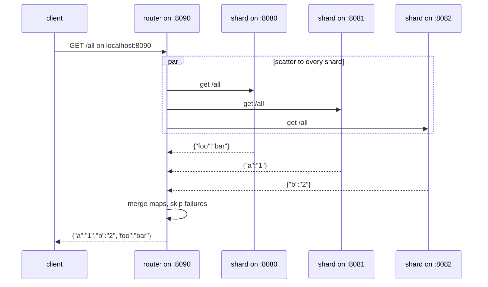

# scatter-gather

this is a simple scatter-gather implementation for reading key-value data spread across distinct shards. a small go router sits in front of the shards, receives the client's requests, and either hashes a single-key request to the shard that owns it or fans a full-read request out to every shard and merges the results.

the client does not call shards directly. it only calls the router at `localhost:8090`. the router keeps the shard list, hashes `?key=` for `/get` and `/set` like sharding does, and fans out `GET /all` to every shard before returning one merged json object.

## architecture

- **shards:** distinct key-value servers that each hold a disjoint subset of keys on `:8080`, `:8081`, and `:8082`, and each serve their full local map on `GET /all`
- **router:** hash-based proxy for `/get` and `/set` plus scatter-gather proxy for `GET /all` that receives client requests on `:8090`
- **client:** any http client that calls the router (for example, `curl`)

the shards and router all run locally as plain processes and talk to each other over `localhost`. that local shape is what lets the router use `http://localhost:8080`, `http://localhost:8081`, and `http://localhost:8082` as its shard addresses.

## flow



single-key requests work exactly like sharding. the router hashes the key with `fnv-32a` and picks the shard with `hashKey(key) % len(shards)`, so the same key always goes to the same shard.

full reads use scatter-gather instead. the router starts one goroutine per shard, each one forwards `GET /all` to its shard, decodes the shard's `map[string]string` body, and sends it on a buffered channel of size `len(shards)`. the router then drains the channel and merges every successful map into one, which it returns as `application/json`.

this is fan-out/fan-in, not hash routing. every shard is queried on every `/all` request, and the merged result is only as complete as the shards that answered.

## things to consider

a failed shard is silently skipped on `/all`. if a forward fails or the shard body is not valid json, that shard is dropped and the router still returns `200` with whatever the remaining shards held. that means `/all` can return an incomplete map with no error telling you a shard was missed.

there is no replication. each key lives on exactly one shard, and each shard stores data in an in-memory `map`, so losing or restarting a shard loses its keys. the router also uses a `2s` http client timeout with no health-checking, so a slow or dead shard just means missing data on `/all` and `500`s on the `/get` and `/set` keys that hash to it.

## usage

start three shards in separate terminals:

```bash
go run ./shard --port=8080
```

```bash
go run ./shard --port=8081
```

```bash
go run ./shard --port=8082
```

start the router in another terminal:

```bash
go run ./router
```

you should see it listen:

```text
[router]: listening on port 8090
```

write a few keys through the router:

```bash
curl -s -X PUT 'localhost:8090/set?key=foo&value=bar'; echo
curl -s -X PUT 'localhost:8090/set?key=a&value=1'; echo
curl -s -X PUT 'localhost:8090/set?key=b&value=2'; echo
```

```text
successfully wrote k,v: {foo:bar}
successfully wrote k,v: {a:1}
successfully wrote k,v: {b:2}
```

read one back through the router:

```bash
curl -s 'localhost:8090/get?key=foo'; echo
```

```text
bar
```

scatter a full read across all shards:

```bash
curl -s 'localhost:8090/all'; echo
```

```text
{"a":"1","b":"2","foo":"bar"}
```

each shard logs the keys it actually handled, so you can see where each key landed:

```text
[shard-8080]: received PUT key="foo" value="bar" from 127.0.0.1:40158
[shard-8081]: received PUT key="a" value="1" from 127.0.0.1:40160
[shard-8082]: received PUT key="b" value="2" from 127.0.0.1:40162
```

to test the scatter-gather, stop one shard and curl `/all` again. the router still returns `200` with the keys from the remaining shards, so the result is smaller but the request succeeds. restart the shard and its keys are gone since storage is in-memory, so `/all` keeps showing only what the live shards hold.
