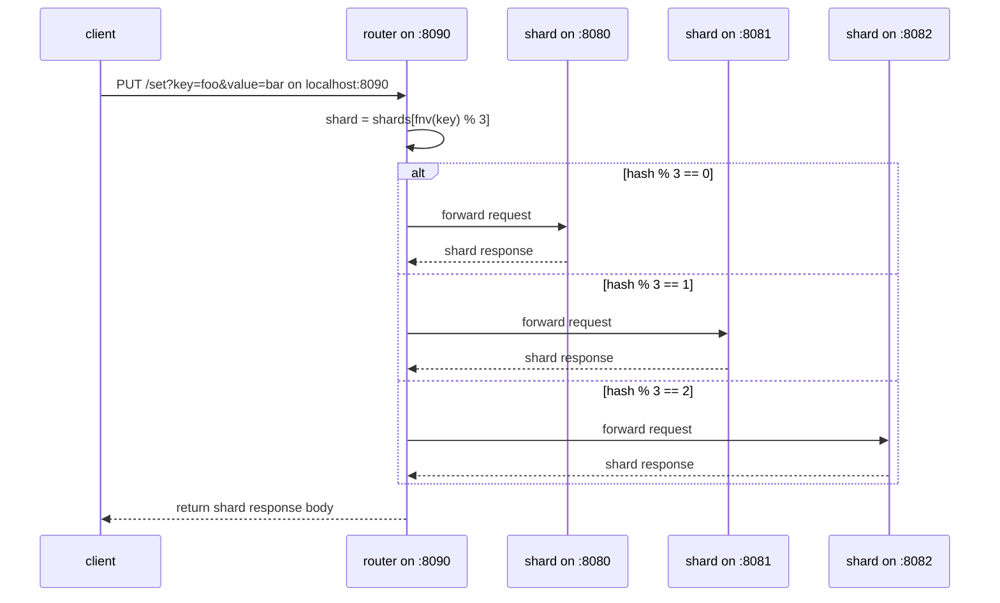

# sharding

this is a simple sharded service implementation for spreading key-value data across distinct shards. a small go router sits in front of the shards, receives the client's requests, hashes the request key, and forwards each request to the shard that owns that key.

the client does not call shards directly. it only calls the router at `localhost:8090`. the router keeps the shard list, hashes `?key=`, then forwards the request to the selected shard.

## architecture

- **shards:** distinct key-value servers that each hold a disjoint subset of keys on `:8080`, `:8081`, and `:8082`
- **router:** hash-based proxy that receives client requests on `:8090` and forwards each one to the shard that owns the key
- **client:** any http client that calls the router (for example, `curl`)

the shards and router all run locally as plain processes and talk to each other over `localhost`. that local shape is what lets the router use `http://localhost:8080`, `http://localhost:8081`, and `http://localhost:8082` as its shard addresses.

## flow



the router hashes the key with `fnv-32a` and picks the shard with `hashKey(key) % len(shards)`.

this is deterministic hash routing, not round-robin or random splitting. the same key always goes to the same shard, while different keys spread across shards based on their hash. if the shard list changes, key placement changes too.

## things to consider

the shard list is hardcoded in `router/router.go`:

```go
numShards := 3
port := 8080
```

the router builds `http://localhost:8080`, `http://localhost:8081`, and `http://localhost:8082` at startup. there is no flag or env var for this yet, so adding or moving a shard means editing the code. the `Router` struct has no mutex because the shard slice is only written during initialization and only read afterwards.

only `/get` and `/set` are routed. the router forwards with `shard + r.URL.Path + "?" + r.URL.RawQuery`, so the path and query are preserved but headers, method bodies, and other routes are not specially handled.

the router does not validate the key. an empty or missing `key` is still hashed and forwarded, and the shard is what rejects it with a `404 missing 'key' parameter` body. note the router only copies the response body with `w.Write(body)` and never copies the status code, so even a shard-side `404` comes back to the client as `200` with the error text as the body.

there is no replication. each key lives on exactly one shard, so losing a shard loses its keys. each shard stores data in an in-memory `map` guarded by a mutex, so restarting a shard wipes everything it held.

there is no health-checking or failover. a dead shard still owns its share of the hash space, and requests that hash to it return `500 failed to forward request`. the router also uses a `2s` http client timeout, so a slow shard fails that request instead of queuing.

adding or removing a shard reshuffles most keys because placement is plain `hash % n`. there is no consistent hashing, so scaling the shard count requires moving almost all data.

## usage

start three shards in separate terminals:

```bash
go run ./shard --port=8080
```

```bash
go run ./shard --port=8081
```

```bash
go run ./shard --port=8082
```

start the router in another terminal:

```bash
go run ./router
```

you should see it listen:

```text
[router]: listening on port 8090
```

write a key through the router:

```bash
curl -s -X PUT 'localhost:8090/set?key=foo&value=bar'; echo
```

```text
successfully wrote k,v: {foo:bar}
```

read it back through the router:

```bash
curl -s 'localhost:8090/get?key=foo'; echo
```

```text
bar
```

each shard logs the keys it actually handled, so you can see where the key landed:

```text
[shard-8080]: received PUT key="foo" value="bar" from 127.0.0.1:40158
[shard-8080]: received GET key="foo" from 127.0.0.1:40158
```

to test the hash placement, write a few different keys and watch which shard logs each one. reading the same key twice always hits the same shard, while different keys spread across `:8080`, `:8081`, and `:8082`. reading a key that was never written returns the shard's `could not find requested key` body.
