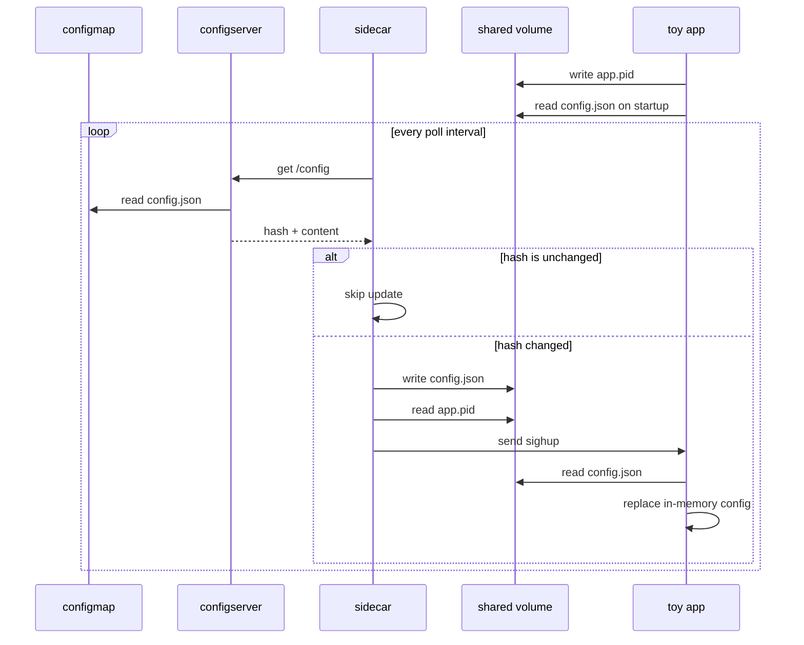

# sidecar

this is a simple sidecar pattern implementation for keeping an app's local config file current. a companion container polls a config source, writes the newest config into a shared volume, then signals the app with `sighup` so it can reload without restarting the pod.

the app does not call the sidecar directly. it only reads `/shared/config.json`, writes its own pid to `/shared/app.pid`, and reloads the file when it receives `sighup`.

## architecture

- **configmap:** stores the source `config.json` in kubernetes
- **configserver:** exposes the current config and hash over http
- **sidecar:** polls configserver, writes `/shared/config.json`, reads `/shared/app.pid`, and sends `sighup`
- **toy app:** loads config on startup and reloads it when signalled

the app and sidecar run in the same kubernetes pod with `shareProcessNamespace: true`. that shared pid namespace is what lets the sidecar signal the app process from a separate container.

## flow



`configserver` reads the mounted configmap file and returns both the raw content and a sha-256 hash. the sidecar keeps the last hash it saw, so it only writes and signals when the config actually changes.

when a new config is detected, the sidecar:

1. writes the latest config into the shared volume
2. reads the app pid from `/shared/app.pid`
3. sends `sighup` to that pid
4. leaves the app to reload the file itself

the app writes its pid during startup before waiting for signals. since the app and sidecar share an `emptyDir` volume, both containers can access the pid file and the synced config file.

## things to consider

this demo keeps the source of truth simple by using a configmap plus a small configserver. configmap updates are not instant inside already-running pods, so restarting `configserver` after updating the configmap is the most predictable way to test changes.

the sidecar can only signal the app because both containers are in the same pod and `shareProcessNamespace` is enabled. without that setting, the pid file alone is not enough.

there is also a startup ordering issue. the app may start before the sidecar has written the first `/shared/config.json`, so the app uses `--startup-wait=30s` and waits for the file before doing its first load. if the file does not appear before the timeout, the app exits and kubernetes restarts the pod. this keeps startup deterministic instead of silently running without config.

## usage

start minikube and build the images inside minikube's docker daemon:

```bash
minikube start
eval $(minikube docker-env)

docker build -t toy-app:latest -f docker/Dockerfile.app .
docker build -t sidecar:latest -f docker/Dockerfile.sidecar .
docker build -t configserver:latest -f docker/Dockerfile.configserver .
```

create the config source from the local file:

```bash
kubectl create configmap app-config-source \
  --from-file=config.json=config.json \
  --dry-run=client -o yaml | kubectl apply -f -
```

deploy everything:

```bash
kubectl apply -f k8s/config_server.yaml
kubectl apply -f k8s/app_dep.yaml

kubectl rollout status deployment/configserver
kubectl rollout status deployment/app
```

watch the app and sidecar logs:

```bash
kubectl logs -l app=toy-app -c toy-app --prefix -f
```

```bash
kubectl logs -l app=toy-app -c sidecar --prefix -f
```

to test a reload, edit `config.json`, update the configmap, then restart only configserver:

```bash
kubectl create configmap app-config-source \
  --from-file=config.json=config.json \
  --dry-run=client -o yaml | kubectl apply -f -

kubectl rollout restart deployment/configserver
kubectl rollout status deployment/configserver
```

recent logs should show the sidecar detecting a changed hash and the app reloading after `sighup`:

```bash
kubectl logs -l app=toy-app -c sidecar --prefix --since=2m
kubectl logs -l app=toy-app -c toy-app --prefix --since=2m
```
